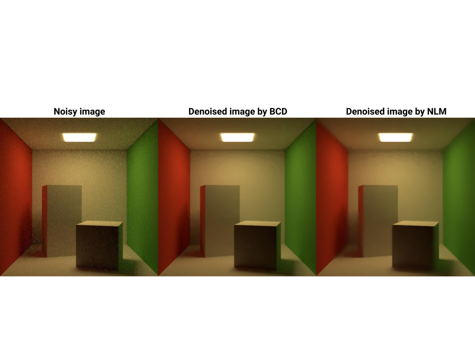
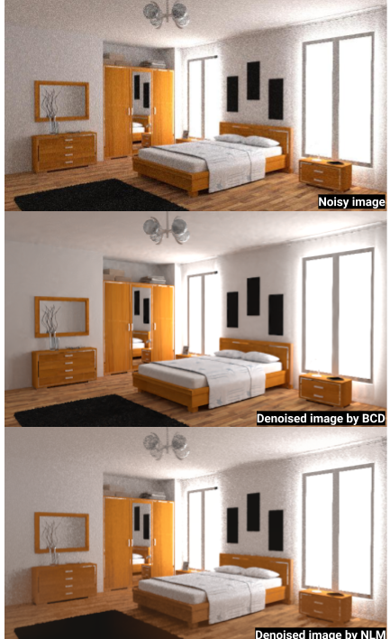

# Bayesan Collaborative Denoiser (BCD)

Alberto Maria Mongardini 1635121

Daniele Passacantilli 1701011

## What we did
1. We integrated the bayesian collaborative denoising ([BCD](https://github.com/superboubek/bcd)) in Yocto/GL. In order to do that:
    * we put the BCD library in the ```/libs``` directory
    * we edited several CMakeList files inside the BCD's directory tree, since most of them contained absolute paths
    * we wrote a new app inside the directory ```/apps``` called 'yimagedenoise'. This application performs denoising on the image given as input using the API provided by BCD
    * we slighty edited the renderer in ```/libs/yocto/yocto_pathtrace.cpp``` in order to generate the file.raw required to use BCD. This library follows a certain format in which pixels of the input image must be provided, so we adapted yocto to create the input file according to specifications
    * we handle both HDR and LDR formats, since the raw file is directly generated inside the renderer
2. We wrote our implementation of the Non-Local Means Denoiser (NLM) following [this](https://www.ipol.im/pub/art/2011/bcm_nlm/article.pdf) paper .

We obtained the following results:

Cornell box:



The parameters used for the NLM are the following:

```
bin/nlm_denoiser --input out/lowres/01_cornellbox_512_256.jpg --output out/nlm_denoised_images/denoised_cornellbox_256.png --patch_r 2 --big_r 10 --h 3  --sigma 5
```


Coffee:


The parameters used for the NLM are the following:

```
bin/nlm_denoiser --input out/lowres/16_coffee_720_256.jpg --output out/nlm_denoised_images/denoised_coffee_256.png --patch_r 1 --big_r 10 --h 2.5  --sigma 10
```

Bedroom:


The parameters used for the NLM are the following:

```
bin/nlm_denoiser --input out/lowres/13_bedroom_720_1024.jpg --output out/nlm_denoised_images/denoised_bedroom_1024.png --patch_r 1 --big_r 60 --h 2  --sigma 10
```