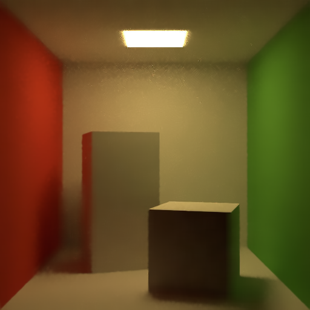
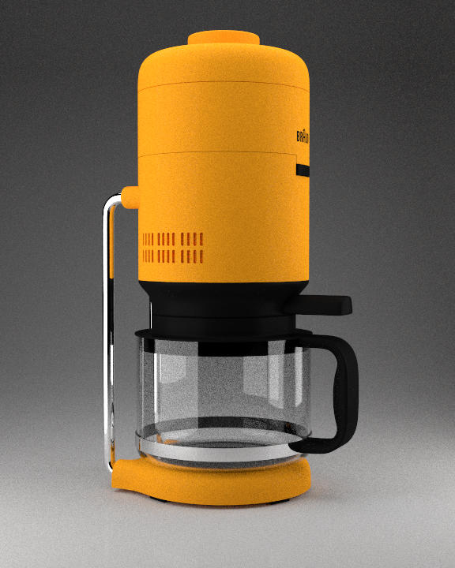

# Bayesan Collaborative Denoiser (BCD)

Alberto Maria Mongardini ...  <br/>
Daniele Passacantilli 1701011

## What we did
1. Abbiamo integrato il bayesian collaborative denoising (BCD) all'interno di yocto. Per fare ciò abbiamo dovuto:
    * Inserire la libreria di BCD all'interno della directory libs
    * Modificare diversi CMakeList (anche quelli all'interno di BCD che presentavano un path assoluto)
    * Scrivere una nuova app, localizzata dentro apps, chiamata yimagedenoise che si occupa di eseguire il denoising dell'immagine passata in input utilizzando BCD
2. Abbiamo implementato un NLM denoiser nell'app nlm_denoiser.

Di seguito riportiamo i risultati ottenuti:

Noisy image:


Denoised image by our NLM with the following parameters:

```
bin/nlm_denoiser --input out/lowres/01_cornellbox_512_256.jpg --output out/nlm_denoised_images/denoised_cornellbox_256_8.png --patch_r 2 --big_r 10 --h 3  --sigma 5
```



Denoised image by BCD:


Noisy image:



Denoised image by our NLM with the following parameters:

```
bin/RelWithDebInfo/nlm_denoiser --input out/lowres/16_coffee_720_256.jpg --output out/nlm_denoised_images/denoised_coffee_256_4.png --patch_r 1 --big_r 10 --h 2.5  --sigma 10
```


Denoised image by BCD:


