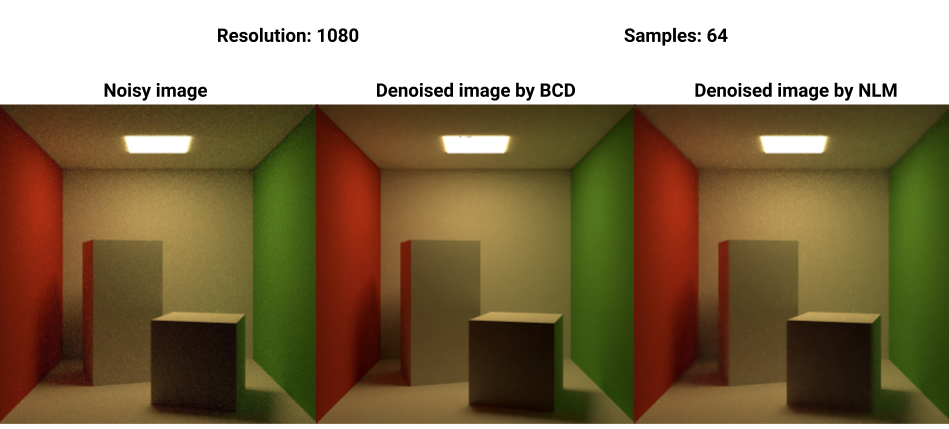

# Bayesan Collaborative Denoiser (BCD)

Alberto Maria Mongardini 1635121

Daniele Passacantilli 1701011

## What we did
1. We integrated the bayesian collaborative denoising ([BCD](https://github.com/superboubek/bcd)) in Yocto/GL. In order to do that:
    * we put the BCD library in the ```/libs``` directory and edited several CMakeList files inside the BCD's directory tree, since most of them contained absolute paths
    * we wrote a new app inside the directory ```/apps``` called 'yimagedenoise'. This application performs denoising on the image given as input using the API provided by BCD
        * the application, given a ```.raw``` file containing all the pixels and their respective samples of an image, first computes its color histogram and covariance matrix, then uses them in order to denoise the image and the result is converted in a ```.png``` and a ```.exr``` images
    * we slighty edited the renderer in ```/libs/yocto/yocto_pathtrace.cpp``` in order to generate the ```.raw``` required to use BCD
        * the library follows a certain format in which pixels of the input image must be provided, so we adapted yocto to create the input file according to specifications
    * we handle both HDR and LDR formats, since the raw file is directly generated inside the renderer
2. We wrote our implementation of the Non-Local Means Denoiser (NLM) following [this](https://www.ipol.im/pub/art/2011/bcm_nlm/article.pdf) paper. The algorithm has the following input parameters:
    * ```--input```: input image path
    * ```--output```: output image path
    * ```--big_r```: the radius ```r``` of the research window. For each pixel ```p``` of the image, a window of size ```(2r + 1) x (2r + 1)``` is scanned around ```p```
    * ```--patch_r```: the radius ```f``` of the patch, that establishes a neighborhood of size ```(2f + 1) x (2f + 1) ```. For each pixel ```p``` of the image, its neighborhood is compared to the neighborhood of each pixel ```q``` in the research window around ```p```, in order to compute the euclidean distance
    * ```--sigma```: standard deviation of the noise contained in the input image. It's used to compute the gaussian weight of each pair of patches
    * ```--h```: fraction of ```sigma```. An high value of ```h``` removes all the noise but also all the details of the image

We applied both BCD and NLM to the output of the yocto pathtracer on different scenes, obtaining the following results:

### Cornell box

As we can see, the BCD's approach performs a consistent denoising, both correctly removing the noise and preserving the details, however slighty altering the illumination. Our NLM implementation, instead, succeeds in removing most of the noise but some details are lost, resulting in a slight blurring effect.





The parameters used for the NLM are the following:

```
--patch_r 2 --big_r 10 --h 3  --sigma 5
```

### Coffee

In this image, NLM removes more noise than BCD, still preserving most of the details, except for a slight blurring effect on the horizontal lines on top of the coffeepot. This is due to the fact that NLM performs well in images characterized by a lower within variance, since for each patch it's easier to find a similar patch inside the respective research window, then performing the adjustment.


The parameters used for the NLM are the following:

```
--patch_r 1 --big_r 10 --h 2.5  --sigma 10
```

### Bedroom

This is the case where NLM gets the worst results, since the scene is much more complex than the previous one and contains a lot of details. NLM in this case fails to find similar patches due to the high variance in the image. BCD instead correctly removes most of the noise still preserving the details. 


---------------------------------------------------------------------------------------------------------------


---------------------------------------------------------------------------------------------------------------


---------------------------------------------------------------------------------------------------------------


---------------------------------------------------------------------------------------------------------------


---------------------------------------------------------------------------------------------------------------


The parameters used for the NLM are the following:

```
--patch_r 2 --big_r 10 --h 2  --sigma 10
```

### Head


The parameters used for the NLM are the following:

```
--patch_r 1 --big_r 10 --h 2  --sigma 10
```
